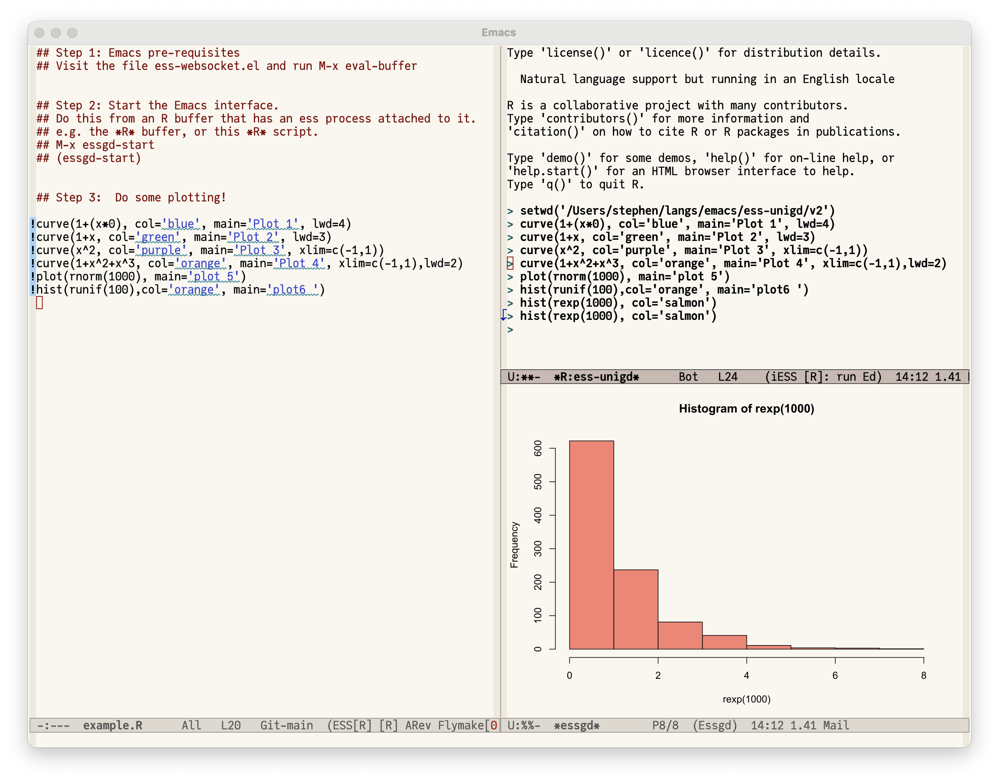

# essgd

This is an add-on to Emacs Speak Statistics (ESS) to display R
plots within a buffer.




## Installation


If you use the straight package:
```
(use-package essgd
  :straight (:type git :host github :repo "sje30/essgd"))
```

Otherwise download the lisp file, open in Emacs, and do M-x
eval-buffer to get started.

## See also

A prototype of this code, and example usage, is available at:

<https://github.com/sje30/ess-unigd>

Laurent Gatto has written a nice R package called 
[plothistory](https://github.com/lgatto/plothistory).  This is not
Emacs-specific, and in my testing, works well remotely via TRAMP.

Thanks to Florian Rupprecht for his excellent
[httpgd](https://github.com/nx10/httpgd) R package.
